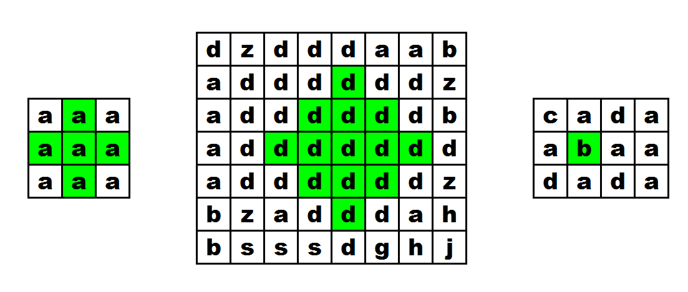

# Codeforces Round 662 (CF1393) 

## Problem A - [Rainbow Dash, Fluttershy and Chess Coloring](https://codeforces.com/contest/1393/problem/A)

### 题目描述


两个人如图中所示轮流给棋盘染色，每次只能给当前与有颜色格子相邻的格子染色。问将棋盘染成两种颜色相间所需要的最少染色次数。

### 题解

简单尝试后可以总结出规律，答案为$\left\lceil\frac{n+1}{2}\right\rceil$。

:::details 参考代码（C++）

```cpp
#include <cstdio>
#include <iostream>

using namespace std;

template <typename T> void read(T &x) {
  x = 0;
  char c = getchar();
  T sig = 1;
  for (; !isdigit(c); c = getchar())
    if (c == '-')
      sig = -1;
  for (; isdigit(c); c = getchar())
    x = (x << 3) + (x << 1) + c - '0';
  x *= sig;
}

class Solution {
public:
  void solve() {
    int n;
    read(n);
    printf("%d\n", n / 2 + 1);
  }
};

int main() {
  ios::sync_with_stdio(false);
  cin.tie(0);
  int t;
  read(t);
  while (t--) {
    Solution solution = Solution();
    solution.solve();
  }
}
```

:::

## Problem B - [Applejack and Storages](https://codeforces.com/contest/1393/problem/B)

### 题目描述

有若干不同长度的木棍，每次查询会增加一根木棍，或减少一根木棍。要求在每次查询后，回答是否能用当前的木棍组成一个正方形和一个长方形。

### 题解

用一个`set`维护当前每种木棍的数量。对于每次询问，假设当前数量最多的三种木棍依次为$A,B,C$，考虑以下几种组合方式：

- 用$8$个$A$
- 用$6$个$A$，$2$个$B$
- 用$4$个$A$，$4$个$B$
- 用$4$个$A$，$2$个$B$，$2$个$C$

如果这些都不行，说明无法组成。

:::details 参考代码（C++）

```cpp
#include <algorithm>
#include <cstdio>
#include <iostream>
#include <set>
#include <vector>

using namespace std;

template <typename T> void read(T &x) {
  x = 0;
  char c = getchar();
  T sig = 1;
  for (; !isdigit(c); c = getchar())
    if (c == '-')
      sig = -1;
  for (; isdigit(c); c = getchar())
    x = (x << 3) + (x << 1) + c - '0';
  x *= sig;
}

class Solution {
public:
  void solve() {
    int n, q;
    read(n);
    vector<int> a(n);
    set<pair<int, int>, greater<>> s;
    vector<int> cnt(100005);
    for (int i = 0; i < n; ++i)
      read(a[i]), cnt[a[i]]++;
    for (int i = 1; i < 100005; ++i)
      if (cnt[i])
        s.insert({cnt[i], i});
    read(q);
    int tot = n;
    for (int i = 0; i < q; ++i) {
      char c;
      int x;
      cin >> c;
      read(x);
      s.erase({cnt[x], x});
      if (c == '+')
        cnt[x]++, tot++;
      else
        cnt[x]--, tot--;
      if (cnt[x])
        s.insert({cnt[x], x});
      bool can = false;
      if (tot >= 8) {
        auto it = s.begin();
        if (it->first >= 8)
          can = true;
        else if (it->first >= 6 && next(it) != s.end() && next(it)->first >= 2)
          can = true;
        else if (it->first >= 4 && next(it) != s.end() && next(it)->first >= 4)
          can = true;
        else if (it->first >= 4 && next(it) != s.end() &&
                 next(it)->first >= 2 && next(next(it)) != s.end() &&
                 next(next(it))->first >= 2)
          can = true;
      }
      printf(can ? "YES\n" : "NO\n");
    }
  }
};

int main() {
  Solution solution = Solution();
  solution.solve();
}
```

:::

## Problem C - [Pinkie Pie Eats Patty-cakes](https://codeforces.com/contest/1393/problem/C)

### 题目描述

有$n$个数，要求找出一种排列方式，让相同数之间的间隔的最小值最大。求出这个最大的最小值。

### 题解

最优方案是把数量等于最大数量的$k$种数按每种一个捆绑到一起，然后剩下的数在它们中间填空。此时的答案为$\left\lfloor\frac{n-hi\cdot k}{hi-1}\right\rfloor+k-1$，其中$hi$为最大数量。

:::details 参考代码（C++）

```cpp
#include <algorithm>
#include <cstdio>
#include <iostream>
#include <vector>

using namespace std;

template <typename T> void read(T &x) {
  x = 0;
  char c = getchar();
  T sig = 1;
  for (; !isdigit(c); c = getchar())
    if (c == '-')
      sig = -1;
  for (; isdigit(c); c = getchar())
    x = (x << 3) + (x << 1) + c - '0';
  x *= sig;
}

class Solution {
public:
  void solve() {
    int n;
    read(n);
    vector<int> a(n), cnt(n + 1);
    for (int i = 0; i < n; ++i)
      read(a[i]), cnt[a[i]]++;
    int hi = *max_element(cnt.begin(), cnt.end());
    int k = 0;
    for (int i : cnt)
      k += i == hi;
    int ans = (n - hi * k) / (hi - 1) + k - 1;
    printf("%d\n", ans);
  }
};

int main() {
  ios::sync_with_stdio(false);
  cin.tie(0);
  int t;
  read(t);
  while (t--) {
    Solution solution = Solution();
    solution.solve();
  }
}
```

:::

## Problem D - [Rarity and New Dress](https://codeforces.com/contest/1393/problem/D)

### 题目描述


求给定的方阵中，类似图中形状的图案的总数。要求图案内所有字母都相同。

### 题解

分左上、右上、左下、右下四个方向动态规划，最后每个位置处就取对应的四个数的最小值。

:::details 参考代码（C++）

```cpp
#include <cstdio>
#include <iostream>
#include <vector>
#define MAXN 2005

using namespace std;
typedef long long ll;

template <typename T> void read(T &x) {
  x = 0;
  char c = getchar();
  T sig = 1;
  for (; !isdigit(c); c = getchar())
    if (c == '-')
      sig = -1;
  for (; isdigit(c); c = getchar())
    x = (x << 3) + (x << 1) + c - '0';
  x *= sig;
}

int fa[MAXN][MAXN], fb[MAXN][MAXN], fc[MAXN][MAXN], fd[MAXN][MAXN];

class Solution {
public:
  void solve() {
    int n, m;
    read(n), read(m);
    vector<string> a(n);
    for (int i = 0; i < n; ++i)
      cin >> a[i];
    ll ans = 0;
    for (int i = 1; i <= n; ++i)
      for (int j = 1; j <= m; ++j) {
        if (i == 1 || j == 1 || a[i - 1][j - 1] != a[i - 2][j - 1] ||
            a[i - 1][j - 1] != a[i - 1][j - 2]) {
          fa[i][j] = 1;
          continue;
        }
        fa[i][j] = min(fa[i - 1][j], fa[i][j - 1]) + 1;
      }

    for (int i = 1; i <= n; ++i)
      for (int j = m; j >= 1; --j) {
        if (i == 1 || j == m || a[i - 1][j - 1] != a[i - 2][j - 1] ||
            a[i - 1][j - 1] != a[i - 1][j]) {
          fb[i][j] = 1;
          continue;
        }
        fb[i][j] = min(fb[i - 1][j], fb[i][j + 1]) + 1;
      }

    for (int i = n; i >= 1; --i)
      for (int j = 1; j <= m; ++j) {
        if (i == n || j == 1 || a[i - 1][j - 1] != a[i][j - 1] ||
            a[i - 1][j - 1] != a[i - 1][j - 2]) {
          fc[i][j] = 1;
          continue;
        }
        fc[i][j] = min(fc[i + 1][j], fc[i][j - 1]) + 1;
      }

    for (int i = n; i >= 1; --i)
      for (int j = m; j >= 1; --j) {
        if (i == n || j == m || a[i - 1][j - 1] != a[i][j - 1] ||
            a[i - 1][j - 1] != a[i - 1][j]) {
          fd[i][j] = 1;
          continue;
        }
        fd[i][j] = min(fd[i + 1][j], fd[i][j + 1]) + 1;
      }

    for (int i = 1; i <= n; ++i)
      for (int j = 1; j <= m; ++j)
        ans += min(min(fa[i][j], fb[i][j]), min(fc[i][j], fd[i][j]));
    printf("%lld", ans);
  }
};

int main() {
  Solution solution = Solution();
  solution.solve();
}
```

:::

## Problem E1 - [Twilight and Ancient Scroll (easier version)](https://codeforces.com/contest/1393/problem/E1)

待补做。

## Problem E2 - [Twilight and Ancient Scroll (harder version)](https://codeforces.com/contest/1393/problem/E2)

待补做。
