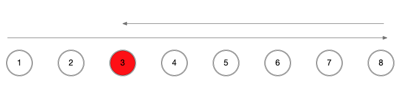

# Codeforces Round 666 (CF1396)

## Div. 2 Problem A - [Juggling Letters](https://codeforces.com/contest/1397/problem/A)

### 题目描述

有$N$个字符串，这些字符串可以任意打乱重新组合，问能否组成$N$个一样的字符串？

### 题解

统计每种字母的个数，看是否都是$N$的倍数即可。

:::details 参考代码（Python 3）

```python
from sys import stdin, stdout


def read_int():
    return int(stdin.readline().strip())


t = read_int()
for case_num in range(t):
    n = read_int()
    counter = [0 for _ in range(26)]

    for i in range(n):
        s = stdin.readline().strip()
        for c in s:
            counter[ord(c) - ord('a')] += 1
    ok = True
    for count in counter:
        if count % n != 0:
            ok = False
            break
    stdout.write('YES\n' if ok else 'NO\n')
```

:::

## Div. 2 Problem B - [Power Sequence](https://codeforces.com/contest/1397/problem/B)

### 题目描述

有一列数，可以无消耗地排列顺序，或者每次消耗$1$来将某个数的大小改变$1$（可以增大或减小）。问最少消耗多少，可以将这列数变为$\{1,c,\cdots,c^{n-1}\}$，其中$c$是一个正整数。

### 题解

首先将数组排序，然后枚举$c$即可。枚举的判断条件可以设置为$c^{n-1}<=2\sum a_i$。

:::details 参考代码（Python 3）

```python
from sys import stdin, stdout


def read_int():
    return int(stdin.readline().strip())


def read_ints():
    return map(int, stdin.readline().strip().split(' '))


n = read_int()
a = list(read_ints())
a.sort()
s = sum(a)
cost = s - n
j = 2
while pow(j, n - 1) <= s * 2:
    b = [1]
    for k in range(n - 1):
        b.append(b[-1] * j)
    tot = sum([abs(a[i] - b[i]) for i in range(n)])
    cost = min(cost, tot)
    j += 1
print(cost)
```

:::

## Problem A - [Multiples of Length](https://codeforces.com/contest/1396/problem/A)

### 题目描述

给定一个长度为$N$的数组（$1\leq N\leq100000$），要求进行**恰好**三次操作，每次选取一个非空的区间$[L,R]$，其长度$len=R-L+1$，给这个区间中的每个数加上$len$的某个倍数（不同的位置可以加不同的值）。问最后能否将整个数组都变为$0$。

### 题解

利用$N-1$和$N$互质来求解。第一次操作区间$[1,N-1]$，第二次操作区间$[2,N]$，最后操作区间$[1,N]$。因为$N-1$和$N$互质，$a(N-1)$可以取遍$N$的所有余数。经过前两次操作，将所有数都变为$N$的倍数，最后一次给每个数加上它的相反数即可。

注意单独处理$N=1$的情况。

:::details 参考代码（C++）

```cpp
#include <cstdio>
#include <iostream>
#include <vector>

using namespace std;
typedef long long ll;

template <typename T> void read(T &x) {
  x = 0;
  char c = getchar();
  T sig = 1;
  for (; !isdigit(c); c = getchar())
    if (c == '-')
      sig = -1;
  for (; isdigit(c); c = getchar())
    x = (x << 3) + (x << 1) + c - '0';
  x *= sig;
}

class Solution {
public:
  void solve() {
    int n;
    read(n);
    vector<ll> a(n);
    for (int i = 0; i < n; ++i)
      read(a[i]);
    if (n == 1) {
      printf("1 1\n%lld\n1 1\n1\n1 1\n-1\n", -a[0]);
      return;
    }
    printf("1 %d\n", n - 1);
    for (int i = 0; i < n - 1; ++i) {
      ll r = (a[i] % n + n) % n;
      a[i] += r * (n - 1);
      printf("%lld ", r * (n - 1));
    }
    printf("\n2 %d\n", n);
    for (int i = 1; i < n; ++i) {
      ll r = (a[i] % n + n) % n;
      a[i] += r * (n - 1);
      printf("%lld ", r * (n - 1));
    }
    printf("\n1 %d\n", n);
    for (ll num : a)
      printf("%lld ", -num);
  }
};

int main() {
  ios::sync_with_stdio(false);
  cin.tie(0);
  Solution solution = Solution();
  solution.solve();
}
```

:::

## Problem B - [Stoned Game](https://codeforces.com/contest/1396/problem/B)

### 题目描述

两个人玩石子游戏，一共有$N$（$1\leq N\leq100$）堆石子，每堆的石子数$1\leq a_i\leq100$。每次可以从任意一堆取出一个石子，但不能从对方刚取的那堆中取。第一个没有石子可取的人输掉游戏。问，给定每堆石子的个数，是先手赢还是后手赢？

### 题解

考虑所有石子中最大的那一堆。如果$\max a_i>\sum a_i - \max a_i$，那么先手有必胜策略：永远先从最多的那一堆中取，这样后手只能从剩下那些堆中取；那么总有一个时刻，先手取完之后，后手将没有石子可取。

如果所有石子中最大的那一堆不超过剩下的石子总数，也即$\max a_i\leq\sum a_i - \max a_i$，那么两个人在取石子时总可以避免出现$\max a_i>\sum a_i - \max a_i$的情况：

- 如果当前最大的一堆可以取，就从中取。
- 如果当前最多的一堆不可以取，代表它刚被取过一次，那么此时有$\max a_i\leq\sum a_i - \max a_i - 1$，因此从剩下任何一堆中取了之后，都仍然保持$\max a_i\leq\sum a_i - \max a_i$。

因此在这种情况下，最后的获胜方取决于石子总数的奇偶性。如果总数为奇数，则先手获胜；否则后手获胜。

:::details 参考代码（C++）

```cpp
#include <cstdio>
#include <iostream>
#include <vector>

using namespace std;
typedef long long ll;

template <typename T> void read(T &x) {
  x = 0;
  char c = getchar();
  T sig = 1;
  for (; !isdigit(c); c = getchar())
    if (c == '-')
      sig = -1;
  for (; isdigit(c); c = getchar())
    x = (x << 3) + (x << 1) + c - '0';
  x *= sig;
}

class Solution {
  struct Node {
    ll time = 0;
    int idx = 0, left = 0;
    bool operator<(const Node &other) const { return time > other.time; }
  };

public:
  void solve() {
    ll n, r1, r2, r3, d;
    read(n), read(r1), read(r2), read(r3), read(d);
    vector<ll> a(n + 1), kill_all(n + 1), leave_one(n + 1);
    for (int i = 1; i <= n; ++i) {
      read(a[i]);
      kill_all[i] = r1 * a[i] + r3;
      leave_one[i] = min(r2, r1 * (a[i] + 1)) + r1;
    }
    vector<ll> L(n + 2), R(n + 2);
    R[n] = min(kill_all[n], leave_one[n] + d * 2);
    for (int i = n - 1; i >= 1; --i)
      R[i] = R[i + 1] + d * 2 + min(kill_all[i], leave_one[i]);
    ll cost = R[1];
    L[0] = R[n + 1] = -d;
    for (int i = 1; i <= n; ++i) {
      L[i] = L[i - 1] + d + min(kill_all[i], leave_one[i] + d * 2);
      if (i >= 2)
        L[i] = min(L[i], L[i - 2] + d * 4 +
                             min(kill_all[i - 1], leave_one[i - 1]) +
                             min(kill_all[i], leave_one[i]));
      cost = min(cost, L[i] + R[i + 1] + d);
    }
    cout << cost;
  }
};

int main() {
  ios::sync_with_stdio(false);
  cin.tie(0);
  Solution solution = Solution();
  solution.solve();
}
```

:::

## Problem C - [Monster Invaders](https://codeforces.com/contest/1396/problem/C)

### 题目描述

有$N$个依次相连的山洞，每个山洞有$a_i$个生命值为$1$的小怪和一个生命值为$2$的Boss。你有三种武器：

- 手枪，可以对一个敌人造成$1$点伤害，用一次耗时$r_1$
- 激光枪，可以对所有敌人造成$1$点伤害，用一次耗时$r_2$
- 狙击枪，可以杀死一个敌人，用一次耗时$r_3$

它们的耗时满足$r_1\leq r_2\leq r_3$。手枪和狙击枪只有打死了所有小怪后才能打Boss，而激光枪可以对小怪和Boss同时造成伤害。如果你对Boss造成伤害但没有打死它，你必须强制移动到相邻的另一个山洞。无论是强制移动还是自己移动，从一个山洞走到相邻山洞的用时固定为$d$。

求杀死所有怪物的最短用时。

### 题解

首先，考虑一个山洞。我们有两种方式杀死这个山洞中所有的怪物：

- 一次杀死Boss。用手枪杀死所有小怪，用狙击枪杀死Boss。这个数值记为$p[i]$。
- 分两次杀死Boss。用手枪杀死所有小怪再攻击一次Boss，或用一次激光枪杀死所有小怪同时对Boss造成$1$点伤害，此时需要被迫离开；下一次来到这个山洞时，再用一次手枪杀死Boss。不考虑移动耗时，只考虑攻击耗时，我们可以选择两种方案中的较小值，记为$q[i]$。

下面我们考虑整体的路线。不妨从最后一个清空的山洞着手。



假设最后我们停在$3$号山洞，我们整体的最优路线应当是图上这样的，也即首先到$3$，然后走到头再走回来。如果不这样走，必然会产生额外的路程。

因此，我们可以把最后的路程分为三部分，清理掉$[1,2]$的耗时，清理掉$[3,8]$的耗时，以及从$2$走到$3$的耗时$d$。

令$L[i]$表示清理掉$[1,i]$，最后停留在$i$号山洞的最短耗时；$R[i]$表示清理掉$[i,N]$，最后停留在$i$号山洞的耗时，我们最后的答案就是

$$\min_{i=1}^NL[i]+R[i+1]+d$$

为了避免对特殊情况的讨论，我们可以令$L[0]=R[N+1]=-d$。

接下来就是如何求$L[i]$和$R[i]$。

先看$R[i]$。$R[n]$比较特殊，我们可以选择一次杀死所有怪物，耗时$p[n]$；也可以分两次，但这意味着我们需要额外用$2d$的时间赶路，总耗时$q[n]+2d$。对于剩下的$R[i]$，因为我们需要从$i$走到$i+1$，再从$i+1$走回来，所以一定经过了$i$号山洞两次，因此总耗时为

$$R[i]=R[i+1]+2d+\min(p[i],q[i])$$

再看$L[i]$。对于每个$L[i]$，我们有两种策略，一种是不走回头路，从$i-1$走过来之后我们一次杀死所有怪物，耗时$L[i-1]+d+p[i]$；二是走回头路，走$i-2\rightarrow i-1\rightarrow i\rightarrow i-1\rightarrow i$这样的路线，从$i-2$（$i\geq2$）开始，在$i-1$处我们选择$\min(p[i-1],q[i-1])$，之后走到$i$，再回到$i-1$，然后再走回$i$，因为经过了$i$两次，所以我们在$i$处可以选择$\min(p[i],q[i])$。比较两种方案，总耗时为

$$L[i]=\min(L[i-1]+d+p[i],L[i-2]+4d+\min(p[i-1],q[i-1])+\min(p[i],q[i]))$$

:::tip 为什么不考虑更前面的位置？

路线$i-3\rightarrow i-2\rightarrow i-1\rightarrow i\rightarrow i-1\rightarrow i-2\rightarrow i-1\rightarrow i$可以调整为$i-3\rightarrow i-2\rightarrow i-1\rightarrow i-2\rightarrow i-1\rightarrow i\rightarrow i-1\rightarrow i$，两条路线的长度都为$7$，并且都经过了$i-2$、$i-1$和$i$至少两次，因此这两种方案的最优取值是一样的。而调整后的路线可以视为从$i-2$出发（因为已经经过了$i-2$两次），所以已经被我们的讨论所包含。因此，考虑回头的情况，只需要考虑到$i-2$即可。

:::

最后我们就可以利用上面得到的式子计算出最后的最短用时。

:::details 参考代码（C++）

```cpp
#include <cstdio>
#include <iostream>
#include <vector>

using namespace std;
typedef long long ll;

template <typename T> void read(T &x) {
  x = 0;
  char c = getchar();
  T sig = 1;
  for (; !isdigit(c); c = getchar())
    if (c == '-')
      sig = -1;
  for (; isdigit(c); c = getchar())
    x = (x << 3) + (x << 1) + c - '0';
  x *= sig;
}

class Solution {
  struct Node {
    ll time = 0;
    int idx = 0, left = 0;
    bool operator<(const Node &other) const { return time > other.time; }
  };

public:
  void solve() {
    ll n, r1, r2, r3, d;
    read(n), read(r1), read(r2), read(r3), read(d);
    vector<ll> a(n + 1), kill_all(n + 1), leave_one(n + 1);
    for (int i = 1; i <= n; ++i) {
      read(a[i]);
      kill_all[i] = r1 * a[i] + r3;
      leave_one[i] = min(r2, r1 * (a[i] + 1)) + r1;
    }
    vector<ll> L(n + 2), R(n + 2);
    R[n] = min(kill_all[n], leave_one[n] + d * 2);
    for (int i = n - 1; i >= 1; --i)
      R[i] = R[i + 1] + d * 2 + min(kill_all[i], leave_one[i]);
    ll cost = R[1];
    L[0] = R[n + 1] = -d;
    for (int i = 1; i <= n; ++i) {
      L[i] = L[i - 1] + d + min(kill_all[i], leave_one[i] + d * 2);
      if (i >= 2)
        L[i] = min(L[i], L[i - 2] + d * 4 +
                             min(kill_all[i - 1], leave_one[i - 1]) +
                             min(kill_all[i], leave_one[i]));
      cost = min(cost, L[i] + R[i + 1] + d);
    }
    cout << cost;
  }
};

int main() {
  ios::sync_with_stdio(false);
  cin.tie(0);
  Solution solution = Solution();
  solution.solve();
}
```

:::

## Problem D - [Rainbow Rectangles](https://codeforces.com/contest/1396/problem/D)

待补题。

## Problem E - [Distance Matching](https://codeforces.com/contest/1396/problem/E)

参见英文版本。
