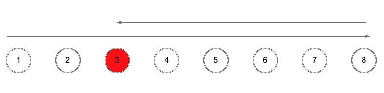

# Codeforces Round 666 (CF1396)

## Div. 2 Problem A - [Juggling Letters](https://codeforces.com/contest/1397/problem/A)

Just count the number of every letter, and check whether every number can be divided by $N$.

:::details Code (Python 3)

```python
from sys import stdin, stdout


def read_int():
    return int(stdin.readline().strip())


t = read_int()
for case_num in range(t):
    n = read_int()
    counter = [0 for _ in range(26)]

    for i in range(n):
        s = stdin.readline().strip()
        for c in s:
            counter[ord(c) - ord('a')] += 1
    ok = True
    for count in counter:
        if count % n != 0:
            ok = False
            break
    stdout.write('YES\n' if ok else 'NO\n')
```

:::

## Div. 2 Problem B - [Power Sequence](https://codeforces.com/contest/1397/problem/B)

First sort the array in ascending order, then enumerate $c$. We can constrain the range of $c$ by $c^{n-1}<=2\sum a_i$, otherwise we can simply change all $a_i$ to $1$ and that will cost less.

:::details Code (Python 3)

```python
from sys import stdin, stdout


def read_int():
    return int(stdin.readline().strip())


def read_ints():
    return map(int, stdin.readline().strip().split(' '))


n = read_int()
a = list(read_ints())
a.sort()
s = sum(a)
cost = s - n
j = 2
while pow(j, n - 1) <= s * 2:
    b = [1]
    for k in range(n - 1):
        b.append(b[-1] * j)
    tot = sum([abs(a[i] - b[i]) for i in range(n)])
    cost = min(cost, tot)
    j += 1
print(cost)
```

:::

## Problem A - [Multiples of Length](https://codeforces.com/contest/1396/problem/A)

We can make use of the fact that $N-1$ and $N$ are coprime. First we operate on $[1,N-1]$ whose length is $N-1$, then we operate on $[2,N]$ whose length is also $N-1$. After two operations, we can make all numbers divided by $N$. Finally we operate on $[1,N]$ whose length is $N$, and we can just add $-a_i$ to each $a_i$ ($a_i$ may have changed after the previous operations).

Note that $N=1$ is an edge case.

:::details Code (C++)

```cpp
#include <cstdio>
#include <iostream>
#include <vector>

using namespace std;
typedef long long ll;

template <typename T> void read(T &x) {
  x = 0;
  char c = getchar();
  T sig = 1;
  for (; !isdigit(c); c = getchar())
    if (c == '-')
      sig = -1;
  for (; isdigit(c); c = getchar())
    x = (x << 3) + (x << 1) + c - '0';
  x *= sig;
}

class Solution {
public:
  void solve() {
    int n;
    read(n);
    vector<ll> a(n);
    for (int i = 0; i < n; ++i)
      read(a[i]);
    if (n == 1) {
      printf("1 1\n%lld\n1 1\n1\n1 1\n-1\n", -a[0]);
      return;
    }
    printf("1 %d\n", n - 1);
    for (int i = 0; i < n - 1; ++i) {
      ll r = (a[i] % n + n) % n;
      a[i] += r * (n - 1);
      printf("%lld ", r * (n - 1));
    }
    printf("\n2 %d\n", n);
    for (int i = 1; i < n; ++i) {
      ll r = (a[i] % n + n) % n;
      a[i] += r * (n - 1);
      printf("%lld ", r * (n - 1));
    }
    printf("\n1 %d\n", n);
    for (ll num : a)
      printf("%lld ", -num);
  }
};

int main() {
  ios::sync_with_stdio(false);
  cin.tie(0);
  Solution solution = Solution();
  solution.solve();
}
```

:::

## Problem B - [Stoned Game](https://codeforces.com/contest/1396/problem/B)

If $\max a_i>\sum a_i - \max a_i$, then T can always win. He can just take stones from the largest pile, while HL can only take from the rest piles. Since $\max a_i>\sum a_i - \max a_i$, there is definitely a time when HL has no stone to take after T takes a stone.

Otherwise, $\max a_i\leq\sum a_i - \max a_i$, then both players can avoid $\max a_i>\sum a_i - \max a_i$ with the following strategy:

- If the maximum pile is currently available, just take from it
- Otherwise, it means that the maximum pile has just been taken, so we have $\max a_i\leq\sum a_i - \max a_i - 1$. No matter which pile we take a stone from, we will have $\max a_i\leq\sum a_i - \max a_i$ afterwards.

So the winner depends on the parity of stones. If the total number of stones is odd, then T wins, otherwise HL wins.

:::details Code (C++)

```cpp
#include <cstdio>
#include <iostream>
#include <vector>

using namespace std;
typedef long long ll;

template <typename T> void read(T &x) {
  x = 0;
  char c = getchar();
  T sig = 1;
  for (; !isdigit(c); c = getchar())
    if (c == '-')
      sig = -1;
  for (; isdigit(c); c = getchar())
    x = (x << 3) + (x << 1) + c - '0';
  x *= sig;
}

class Solution {
  struct Node {
    ll time = 0;
    int idx = 0, left = 0;
    bool operator<(const Node &other) const { return time > other.time; }
  };

public:
  void solve() {
    ll n, r1, r2, r3, d;
    read(n), read(r1), read(r2), read(r3), read(d);
    vector<ll> a(n + 1), kill_all(n + 1), leave_one(n + 1);
    for (int i = 1; i <= n; ++i) {
      read(a[i]);
      kill_all[i] = r1 * a[i] + r3;
      leave_one[i] = min(r2, r1 * (a[i] + 1)) + r1;
    }
    vector<ll> L(n + 2), R(n + 2);
    R[n] = min(kill_all[n], leave_one[n] + d * 2);
    for (int i = n - 1; i >= 1; --i)
      R[i] = R[i + 1] + d * 2 + min(kill_all[i], leave_one[i]);
    ll cost = R[1];
    L[0] = R[n + 1] = -d;
    for (int i = 1; i <= n; ++i) {
      L[i] = L[i - 1] + d + min(kill_all[i], leave_one[i] + d * 2);
      if (i >= 2)
        L[i] = min(L[i], L[i - 2] + d * 4 +
                             min(kill_all[i - 1], leave_one[i - 1]) +
                             min(kill_all[i], leave_one[i]));
      cost = min(cost, L[i] + R[i + 1] + d);
    }
    cout << cost;
  }
};

int main() {
  ios::sync_with_stdio(false);
  cin.tie(0);
  Solution solution = Solution();
  solution.solve();
}
```

:::

## Problem C - [Monster Invaders](https://codeforces.com/contest/1396/problem/C)

First, let's consider one level. We have two ways to clear all monsters:

- Kill the boss with one shot. We use pistol to kill all normal monsters, then use AWP to kill the boss. The total time cost is $p[i]=a[i]\cdot r_1+r_3$.
- Kill the boss with two shots. We can use pistol to kill all normal monsters, and then attack the boss once. Or we can use the laser gun to kill all normal monsters while damaging the boss at the same time. Then we are forced to leave. The next time we reach this level, we use pistol again to kill the boss. If we only consider the time spent on reloading, the total time cost is $q[i]=\min((a[i]+1)\cdot r_1, r_2)+r_1$.

Now we can consider the general route. Let's reflect on where we shall end.


Supposing we end at $3$, our best choice should be like the figure above. That is to say, we first come to $3$, then we go to the other end and go back to $3$. Otherwise we will spend extra time on teleportation.

So we can divide the total time cost into three parts. The time cost of $[1,2]$, the time cost of $[3,8]$ and the time cost of moving from $2$ to $3$ which is $d$.

Let $L[i]$ be the minimal time to clear $[1,i]$ and stop at level $i$, $R[i]$ be the minimal time to clear $[i,N]$ and stop at level $i$, our final answer would be

$$
\min_{i=1}^NL[i]+R[i+1]+d
$$

In order to avoid edge cases, we can let $L[0]=R[N+1]=-d$.

Then we need to solve $L[i]$ and $R[i]$.

$R[n]$ is special, because there are no further levels. We can choose to kill all monsters in $p[n]$, or use the teleportation twice and spend $q[n]+2d$. For rest $R[i]$, since we need to go from $i$ to $i+1$ and then go back to $i$, so we must have passed level $i$ twice. So the total time cost is 

$$
R[i]=R[i+1]+2d+\min(p[i],q[i])
$$

Then we will consider $L[i]$. For $L[i]$, we have two strategies.

1. Not going back. We go from level $i-1$ to level $i$ then kill all monsters, using $L[i-1]+d+p[i]$.
2. Going back. We take the route $i-2\rightarrow i-1\rightarrow i\rightarrow i-1\rightarrow i$. Since we have passed level $i-1$ and $i$ twice, we can use both $p[i-1]$ and $q[i-1]$, and $p[i]$ and $q[i]$.

Comparing the two strategies, we will have

$$
L[i]=\min(L[i-1]+d+p[i],L[i-2]+4d+\min(p[i-1],q[i-1])+\min(p[i],q[i]))
$$

:::tip Why don't we consider going back further?

Consider route $i-3\rightarrow i-2\rightarrow i-1\rightarrow i\rightarrow i-1\rightarrow i-2\rightarrow i-1\rightarrow i$.

It can be rearranged to $i-3\rightarrow i-2\rightarrow i-1\rightarrow i-2\rightarrow i-1\rightarrow i\rightarrow i-1\rightarrow i$, and the length does not change. Moreover, both routes pass level $i-2$, $i-1$ and $i$ at least twice. So these two routes come to the same optimal value. The second part of the rearranged route is just what we have considered ($i-2\rightarrow i-1\rightarrow i\rightarrow i-1\rightarrow i$), yet the first part of the rearranged route ($i-3\rightarrow i-2\rightarrow i-1\rightarrow i-2$) is no better than $L[i-2]$ so we do not need to consider it.

:::

We can then use the formula we come to earlier to calculate the final answer.

:::details Code (C++)

```cpp
#include <cstdio>
#include <iostream>
#include <vector>

using namespace std;
typedef long long ll;

template <typename T> void read(T &x) {
  x = 0;
  char c = getchar();
  T sig = 1;
  for (; !isdigit(c); c = getchar())
    if (c == '-')
      sig = -1;
  for (; isdigit(c); c = getchar())
    x = (x << 3) + (x << 1) + c - '0';
  x *= sig;
}

class Solution {
  struct Node {
    ll time = 0;
    int idx = 0, left = 0;
    bool operator<(const Node &other) const { return time > other.time; }
  };

public:
  void solve() {
    ll n, r1, r2, r3, d;
    read(n), read(r1), read(r2), read(r3), read(d);
    vector<ll> a(n + 1), kill_all(n + 1), leave_one(n + 1);
    for (int i = 1; i <= n; ++i) {
      read(a[i]);
      kill_all[i] = r1 * a[i] + r3;
      leave_one[i] = min(r2, r1 * (a[i] + 1)) + r1;
    }
    vector<ll> L(n + 2), R(n + 2);
    R[n] = min(kill_all[n], leave_one[n] + d * 2);
    for (int i = n - 1; i >= 1; --i)
      R[i] = R[i + 1] + d * 2 + min(kill_all[i], leave_one[i]);
    ll cost = R[1];
    L[0] = R[n + 1] = -d;
    for (int i = 1; i <= n; ++i) {
      L[i] = L[i - 1] + d + min(kill_all[i], leave_one[i] + d * 2);
      if (i >= 2)
        L[i] = min(L[i], L[i - 2] + d * 4 +
                             min(kill_all[i - 1], leave_one[i - 1]) +
                             min(kill_all[i], leave_one[i]));
      cost = min(cost, L[i] + R[i + 1] + d);
    }
    cout << cost;
  }
};

int main() {
  ios::sync_with_stdio(false);
  cin.tie(0);
  Solution solution = Solution();
  solution.solve();
}
```

:::

## Problem D - [Rainbow Rectangles](https://codeforces.com/contest/1396/problem/D)

Not yet.

## Problem E - [Distance Matching](https://codeforces.com/contest/1396/problem/E)

First we want to find when the problem has no answer.

Considering $dist(u,v)=dep(u)+dep(v)-2\cdot dep(LCA(u,v))$, we can conclude that all possible values have the same parity, since they share the $\sum dep(i)$ part, while the second part is always even.

Now let's turn to the perspective of edges. We randomly choose a root, then for each non-root node, we consider the edge from its parent to it. We define $sz[i]$ to be the size of the subtree rooted at $i$. Then the edge can be counted at most $\min(sz[i],n-sz[i])$ times (we try to make as many pairs as we can from nodes in the subtree to the outer nodes). Meanwhile, it will be counted at least $sz[i] \% 2$ times (we try to make as many pairs as we can in its subtree). For this part, see also [CF1280C - Jeremy Bearimy](https://codeforces.com/problemset/problem/1280/C).

So we have found the lowered bound $LB=\sum_{i\neq root} sz[i]\%2$ and the upper bound $UB=\sum_{i\neq root} \min(sz[i],n-sz[i])$. And we have known its parity must conform to that of $LB$ and $UB$. If $k<LB$, $k>UB$ or $k$'s parity is different from $LB$'s, the problem has no answer.

Can we definitely find a valid answer if $LB\leq k\leq UB$ and $k-LB$ is even?

Yes, we can, based on the strategy below.

We will consider how many nodes in each subtree (except the root tree) are cross matched (matched with an external node). The upper limit for each subtree has been calculated in the last step, which equals to $w[i]=\min(sz[i],n-sz[i])$. We use binary search to find the minimal global upper bound $limit$ which will be applied to all subtrees, so that

$cross\_match[i]=\min(w[i], limit+(w[i]-limit)\%2)$ and $\sum_{i\neq root}cross\_match[i]\geq k$

both hold. Note that the $(w[i]-limit)\%2$ part is added so that the parity can be kept.

Since we need $\sum_{i\neq root}cross\_match[i]=k$, further modification is required. Here we only modify those nodes with $cross\_match[i]=limit+1$ to $limit-1$, until the updated sum meets the requirement. Since $limit$ is the minimal possible value to make $\sum_{i\neq root}cross\_match[i]\geq k$, it is ensured that we can meet the requirement within finite steps, otherwise $limit-1$ will also make $\sum_{i\neq root}cross\_match[i]\geq k$, which contradicts with the premise.

Now that we have constructed all $cross\_match[i]$, how can we ensure that a valid matching can be made based on it? Let's consider an invalid configuration instead. In an invalid configuration, there must be a node $u$ where $cross\_match[u]>\sum_{v\text{\ is\ }u\text{'s child}}cross\_match[v]+1$, but this case has been excluded via the global upper bound.

Since we already have a valid configuration, we now need to implement it.

We will use another DFS, and handle the deepest subtrees first, because a cross match for a deeper subtree will finally become an internal match at a higher level. For each subtree, we deal with its internal matches. Note that all sub-subtrees of current subtree will have no more internal matches, since that has been handled earlier, so we must match a node in one sub-subtree with a node in another sub-subtree. To achieve that, we will use a `set` to store the current number of unmatched nodes in every sub-subtree (the root of the current subtree is also considered a sub-subtree with a single element). Every time, we choose one node from the largest group, and one node from the second largest group, then make them a pair. We repeat this until the number of internally matched nodes has met our configuration. Since all remaining unmatched nodes will be handled outside the current subtree, they will be cross matched just as we have expected. 

We still have a few finishing touches. We need to collect all unmatched nodes in the sub-subtrees and put them into the $to\_match$ list of the current subtree. There is a trick in this step: we need to always merge a shorter vector into a longer one, in order to save time.

This solution is from [jiangly](https://codeforces.com/profile/jiangly).

:::details Code (C++, based on jiangly's solution)

```cpp
#include <cstdio>
#include <iostream>
#include <set>
#include <vector>

using namespace std;
typedef long long ll;

template <typename T> void read(T &x) {
  x = 0;
  char c = getchar();
  T sig = 1;
  for (; !isdigit(c); c = getchar())
    if (c == '-')
      sig = -1;
  for (; isdigit(c); c = getchar())
    x = (x << 3) + (x << 1) + c - '0';
  x *= sig;
}

class Solution {
  vector<vector<int>> adj, to_match;
  vector<int> size, cross_match;

  void dfs(int u, int p) {
    size[u] = 1;
    for (int v : adj[u])
      if (v != p) {
        dfs(v, u);
        size[u] += size[v];
      }
  }

  void match_in_subtree(int u, int p) {
    int remain = 1;
    to_match[u].emplace_back(u);
    set<pair<int, int>, greater<>> s;
    s.emplace(1, u);
    for (int v : adj[u])
      if (v != p) {
        match_in_subtree(v, u);
        remain += to_match[v].size();
        s.emplace(to_match[v].size(), v);
      }
    int internal_match = remain - cross_match[u];
    while (internal_match) {
      int first = s.begin()->second;
      s.erase(*s.begin());
      int second = s.begin()->second;
      s.erase(*s.begin());
      printf("%d %d\n", to_match[first].back(), to_match[second].back());
      to_match[first].pop_back();
      to_match[second].pop_back();
      if (!to_match[first].empty())
        s.emplace(to_match[first].size(), first);
      if (!to_match[second].empty())
        s.emplace(to_match[second].size(), second);
      internal_match -= 2;
    }
    for (int v : adj[u])
      if (v != p) {
        // Insert the shorter vector after the longer vector.
        if (to_match[v].size() > to_match[u].size())
          swap(to_match[v], to_match[u]);
        to_match[u].insert(to_match[u].end(), to_match[v].begin(),
                           to_match[v].end());
      }
  }

public:
  void solve() {
    int n;
    ll k;
    read(n), read(k);
    adj = vector<vector<int>>(n + 1);
    size = vector<int>(n + 1);
    cross_match = vector<int>(n + 1);
    for (int i = 0; i < n - 1; ++i) {
      int u, v;
      read(u), read(v);
      adj[u].emplace_back(v);
      adj[v].emplace_back(u);
    }
    dfs(1, 0);
    ll lo = 0, hi = 0;
    for (int i = 2; i <= n; ++i) {
      lo += size[i] % 2;
      hi += cross_match[i] = min(size[i], n - size[i]);
    }
    if (k < lo || k > hi || (k - lo) % 2 != 0) {
      printf("NO");
      return;
    }
    printf("YES\n");
    int l = 0, r = n;
    while (l <= r) {
      int mid = (l + r) >> 1;
      ll score = 0;
      for (int i = 2; i <= n; ++i) {
        if (cross_match[i] >= mid)
          score += mid + (cross_match[i] - mid) % 2;
        else
          score += cross_match[i];
      }
      if (score >= k)
        r = mid - 1;
      else
        l = mid + 1;
    }
    int &limit = l;
    ll score = 0;
    for (int i = 2; i <= n; ++i) {
      if (cross_match[i] >= limit)
        cross_match[i] = limit + (cross_match[i] - limit) % 2;
      score += cross_match[i];
    }

    // Currently score >= k, we need to make score = k;
    for (int i = 2; i <= n; ++i)
      if (cross_match[i] == limit + 1 && score > k) {
        score -= 2;
        cross_match[i] -= 2;
      }

    to_match = vector<vector<int>>(n + 1);
    match_in_subtree(1, 0);
  }
};

int main() {
  ios::sync_with_stdio(false);
  cin.tie(0);
  Solution solution = Solution();
  solution.solve();
}
```

:::
